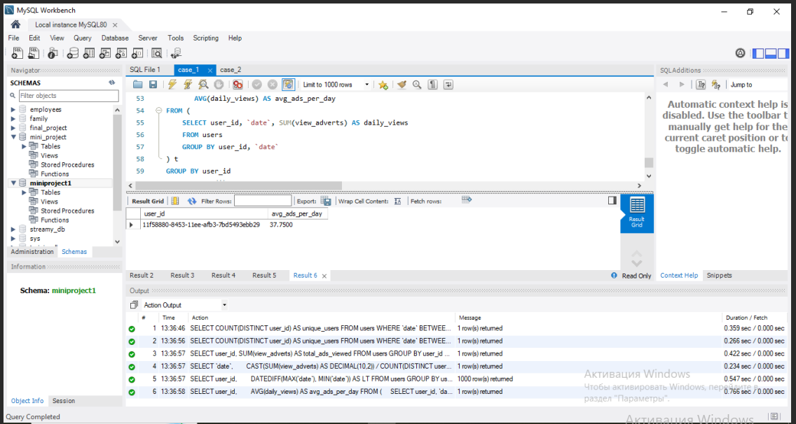

## 🇬🇧 English version

# SQL Business Analytics Portfolio

## Projects Overview
Two business analytics cases built in MySQL.

---

## Case 1: User Behavior Analytics (MySQL)
**Business context:** Ad platform — tracking user activity and engagement

Key questions answered:
- Unique active users in date range
- Top content consumer identification  
- Best-performing day by avg ad views (DAU > 500 filter)
- User Lifetime calculation
- Power users: avg daily activity, min 5 active days

**Skills:** DATE filtering, GROUP BY + HAVING, subqueries, sorting

---

## Case 2: Sales & HR Analytics (MySQL)
**Business context:** Retail sales performance + employee compensation analysis

Key questions answered:
- Product category breakdown
- Revenue by product type
- High-earner identification (salary > 100K)
- Employee with zero sales (LEFT JOIN + NULL)
- Full employee-sales profile via JOIN

**Skills:** DDL (CREATE/INSERT), JOINs, aggregations, NULL handling

---

## 🇷🇺 Русская версия
Два кейса бизнес-аналитики на MySQL.

## Кейс 1: Аналитика поведения пользователей

**Контекст:** Платформа онлайн-объявлений отслеживает ежедневную активность пользователей и просмотры рекламы.

Решаемые задачи: подсчёт уникальных пользователей за период, определение самого активного пользователя, поиск дня с максимальной рекламной вовлечённостью (с фильтром DAU > 500), расчёт Lifetime каждого пользователя и выявление power users среди тех, кто был активен минимум 5 дней.

Ключевые техники: `COUNT(DISTINCT)`, фильтрация по датам, `GROUP BY` + `HAVING`, `DATEDIFF`, подзапросы.

## Кейс 2: Аналитика продаж и HR

**Контекст:** Розничная компания анализирует эффективность продаж товаров и сопоставляет данные с информацией о сотрудниках.

Решаемые задачи: анализ категорий и выручки по товарам, агрегация продаж по продавцам, фильтрация сотрудников по зарплате и возрасту, построение полного профиля сотрудника через JOIN, поиск сотрудников без продаж.

Ключевые техники: DDL (`CREATE TABLE`, `INSERT INTO`), `JOIN` и `LEFT JOIN`, `NULL` handling, агрегатные функции.

## Скриншоты проекта

